# B4. Thiết Kế Phần Mềm Cho Hệ Thống - v2.0

Tài liệu này là bản rút gọn, dùng để thuyết trình. Nội dung tập trung vào ý chính và các flow dễ hiểu của hệ thống.

Hệ thống gồm 2 phần mềm chạy trên 2 ESP32:

- **Node cảm biến**: đo nhiệt độ, độ ẩm không khí, độ ẩm đất, pin; gửi dữ liệu qua LoRa; nhận lệnh; sau đó ngủ để tiết kiệm pin.
- **Gateway**: nhận dữ liệu LoRa từ node; kiểm tra dữ liệu; hiển thị web dashboard; xuất CSV; gửi dữ liệu lên ThingsBoard; gửi lệnh ngược lại cho node.

---

## B4.1. Tổng quan hoạt động

### Ý tưởng chính

Node không chạy liên tục. Node chỉ thức dậy trong thời gian ngắn để đo cảm biến, gửi dữ liệu, nhận phản hồi rồi quay lại deep sleep. Gateway chạy liên tục để nhận dữ liệu và hiển thị cho người dùng.

### Flow tổng quát

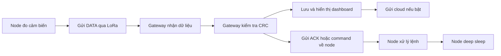

Nói ngắn gọn khi thuyết trình:

> Node đo dữ liệu rồi gửi lên gateway bằng LoRa. Gateway kiểm tra, lưu, hiển thị lên web và có thể gửi dữ liệu lên ThingsBoard. Nếu có lệnh điều khiển, gateway gửi kèm trong ACK để node nhận và thực hiện.

---

## B4.2. Flow của node cảm biến

### Chức năng của node

Node làm các việc chính sau:

1. Thức dậy từ deep sleep.
2. Bật nguồn cảm biến.
3. Đọc DHT22, cảm biến đất và điện áp pin.
4. Đóng gói dữ liệu thành packet `DATA`.
5. Gửi packet qua LoRa.
6. Chờ gateway trả `ACK`.
7. Nếu ACK có command thì thực hiện command.
8. Tắt cảm biến và LoRa.
9. Quay lại deep sleep.

### Flow node rút gọn

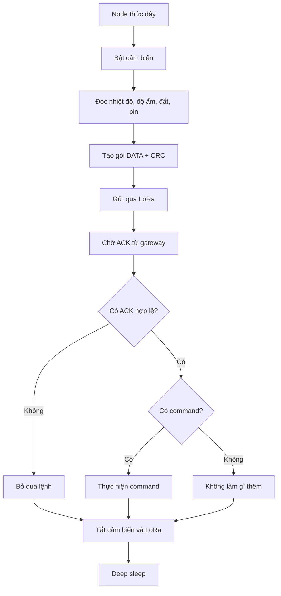

### Các command node có thể nhận

| Command | Ý nghĩa dễ hiểu |
| --- | --- |
| `SET_SLEEP_DURATION` | Đổi thời gian ngủ của node |
| `SET_THRESHOLD` | Đổi ngưỡng độ ẩm đất |
| `SET_FILTER_MODE` | Đổi kiểu lọc dữ liệu |
| `SET_PUMP_TIME` | Đổi thời gian bơm cấu hình |
| `SET_CONTROL_MODE` | Đổi chế độ manual/auto |
| `SET_DUTY_CYCLE` | Đổi cách tính thời gian ngủ |
| `START_PUMP` | Yêu cầu bật bơm nếu phần cứng cho phép |
| `START_OTA` | Bắt đầu mô phỏng OTA cho node |

---

## B4.3. Flow đọc cảm biến

### DHT22

DHT22 dùng để đo nhiệt độ và độ ẩm không khí. Code tự đọc tín hiệu từ cảm biến, sau đó kiểm tra lỗi.

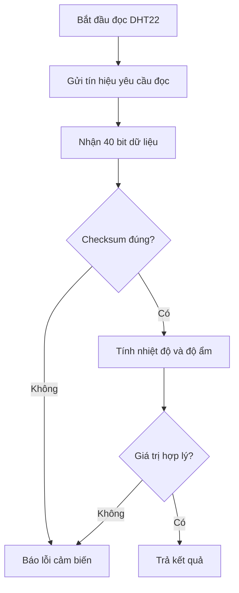

Cách trình bày:

> DHT22 gửi về dữ liệu dạng bit. Chương trình kiểm tra checksum và kiểm tra giá trị có nằm trong giới hạn hợp lý không. Nếu hợp lệ thì dùng kết quả, nếu sai thì báo lỗi.

### Cảm biến độ ẩm đất

Cảm biến đất được đọc qua ADC. Giá trị ADC được lọc rồi quy đổi ra phần trăm độ ẩm đất.

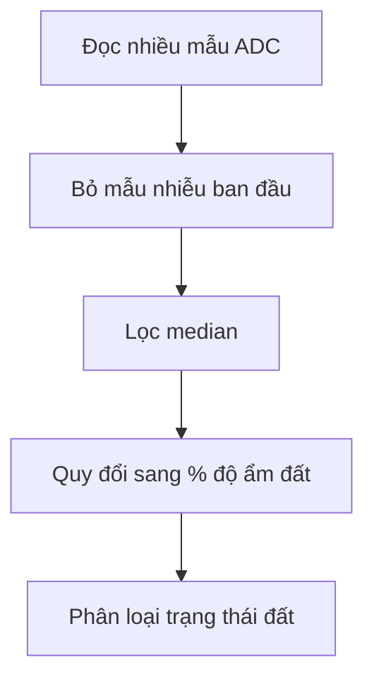

Bảng trạng thái đất:

| Độ ẩm đất | Trạng thái | Ý nghĩa |
| ---: | --- | --- |
| Trên 42% | `OVER_MOISTURE` | Đất quá ẩm |
| 33% - 42% | `NORMAL` | Đất bình thường |
| 24% - 33% | `LIGHT_DRY` | Đất hơi khô |
| 15% - 24% | `NEED_WATERING` | Cần tưới |
| Dưới 15% | `URGENT_WATERING` | Cần tưới gấp |

---

## B4.4. Giao thức truyền LoRa

Hệ thống dùng packet dạng text `KEY=VALUE`, ví dụ:

```text
TYPE=DATA,NODE=1,PID=1,T=30.1,HA=70.2,HS=25.0,VB=4.05,SOIL=LIGHT_DRY,CRC=....
```

### Các loại packet chính

| Packet | Chiều truyền | Mục đích |
| --- | --- | --- |
| `DATA` | Node → Gateway | Gửi dữ liệu cảm biến |
| `ACK` | Gateway → Node | Xác nhận đã nhận dữ liệu, có thể kèm command |
| `OTA_CHUNK` | Gateway → Node | Gửi từng phần dữ liệu OTA mô phỏng |
| `OTA_STATUS` | Node → Gateway | Báo trạng thái OTA mô phỏng |

### Flow gửi DATA và nhận ACK

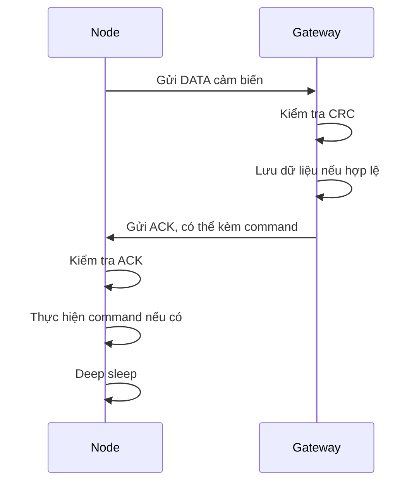

### CRC dùng để làm gì?

CRC là mã kiểm tra lỗi. Khi gửi packet, thiết bị gửi sẽ tính CRC và gắn vào cuối packet. Thiết bị nhận tính lại CRC. Nếu hai CRC giống nhau thì dữ liệu được xem là hợp lệ, nếu khác nhau thì packet bị lỗi và bị bỏ qua.

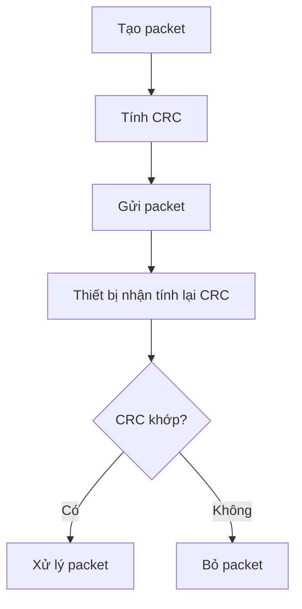

---

## B4.5. Flow của gateway

### Chức năng của gateway

Gateway làm các việc chính sau:

1. Khởi động LoRa, WiFi và web server.
2. Luôn lắng nghe packet từ node.
3. Kiểm tra CRC của packet.
4. Lưu dữ liệu mới vào history.
5. Hiển thị dữ liệu trên web dashboard.
6. Upload ThingsBoard nếu được cấu hình.
7. Gửi ACK hoặc command về node.

### Flow gateway rút gọn

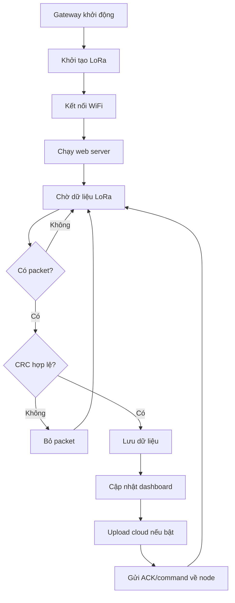

### Vì sao gateway cần pending command?

Node thường đang ngủ nên gateway không thể gửi lệnh bất kỳ lúc nào. Vì vậy gateway phải lưu lệnh trước. Khi node thức dậy và gửi DATA, gateway mới gửi command kèm trong ACK.

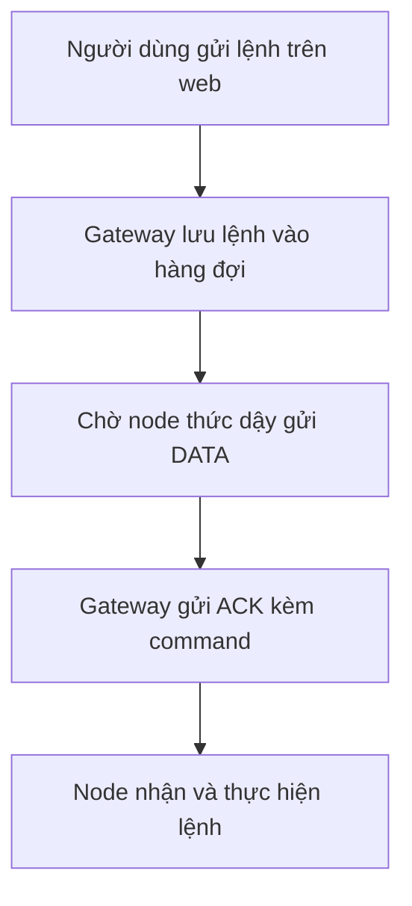

Cách nói khi thuyết trình:

> Vì node tiết kiệm pin nên phần lớn thời gian nó ngủ. Gateway muốn gửi lệnh thì phải chờ node thức dậy. Do đó lệnh được lưu tạm trong gateway và gửi kèm ACK khi node gửi dữ liệu lên.

---

## B4.6. Web dashboard và cloud

### Web dashboard

Gateway tạo web server để người dùng xem dữ liệu bằng trình duyệt.

Các đường dẫn chính:

| Endpoint | Chức năng |
| --- | --- |
| `/` | Trang dashboard chính |
| `/ping` | Kiểm tra gateway còn hoạt động |
| `/export.csv` | Tải dữ liệu lịch sử dạng CSV |
| `/command?node=1&cmd=...&param=...` | Gửi command xuống node |
| `/self_ota?url=...&md5=...` | OTA firmware cho gateway |

### Flow dashboard

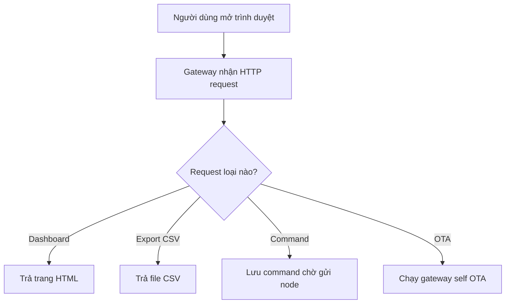

### Upload ThingsBoard

Gateway chỉ upload cloud khi đủ điều kiện:

- Bật cấu hình upload.
- WiFi đã kết nối.
- Có token ThingsBoard.
- Dữ liệu telemetry hợp lệ.

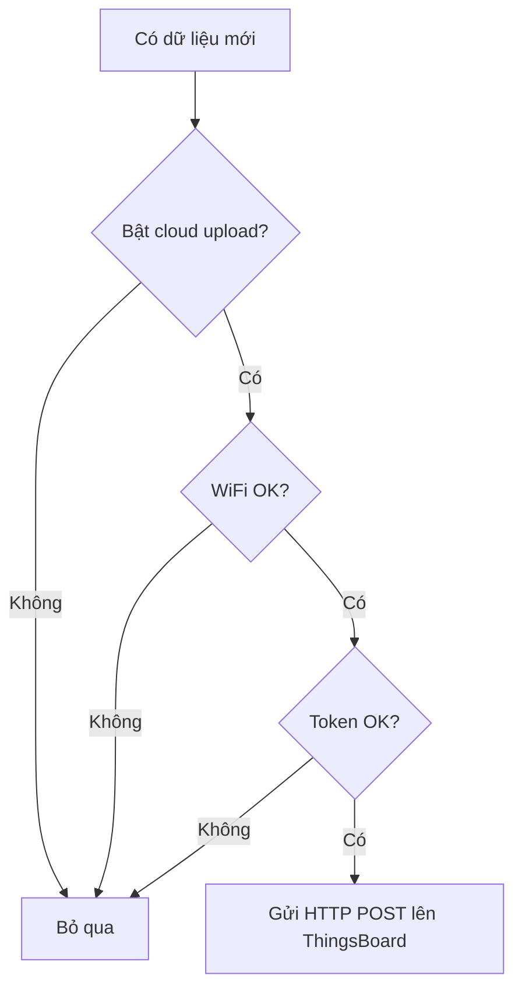

---

## B4.7. OTA trong hệ thống

Hệ thống có 2 loại OTA:

| Loại OTA | Trạng thái | Giải thích |
| --- | --- | --- |
| Gateway OTA qua WiFi/HTTP | OTA thật | Gateway tải file firmware `.bin` và ghi vào flash |
| Node OTA qua LoRa | OTA mô phỏng | Chỉ mô phỏng gửi chunk và kiểm tra CRC, chưa ghi firmware thật |

### Flow gateway OTA thật

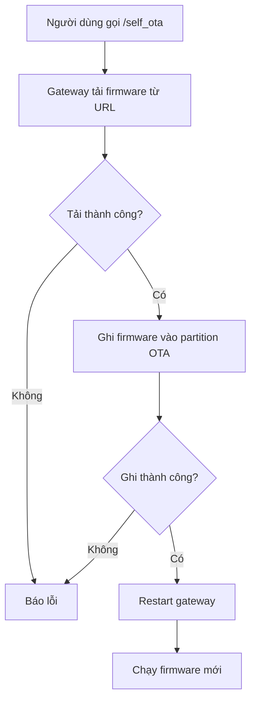

### Flow node OTA mô phỏng

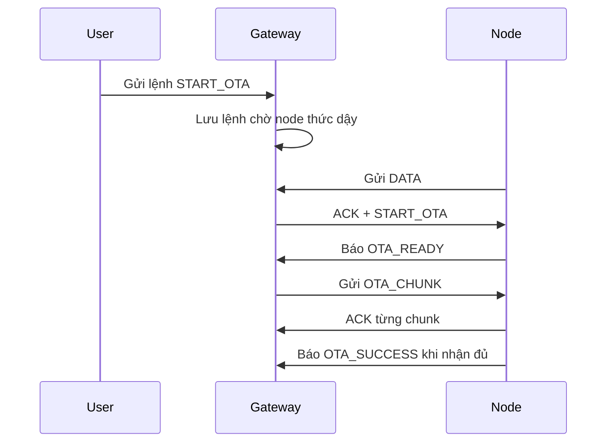

Điểm quan trọng cần nói rõ:

> OTA của gateway là OTA thật. OTA của node qua LoRa hiện tại là mô phỏng quy trình truyền firmware theo từng chunk và kiểm tra CRC, chưa ghi firmware thật vào flash node.

---

## B4.8. Xử lý lỗi và tăng độ tin cậy

Hệ thống có các cơ chế giúp chạy ổn định hơn:

| Cơ chế | Tác dụng |
| --- | --- |
| CRC | Phát hiện packet LoRa bị lỗi |
| ACK | Node biết gateway đã nhận dữ liệu |
| Timeout ACK | Node không chờ quá lâu, vẫn ngủ để tiết kiệm pin |
| Dedup `NODE/PID` | Gateway không lưu trùng packet |
| Retry command | Tăng khả năng node nhận được lệnh |
| Kiểm tra cảm biến | Phát hiện dữ liệu sai hoặc bất thường |
| Error flag | Gateway biết dữ liệu có lỗi cảm biến |

### Flow xử lý lỗi đơn giản

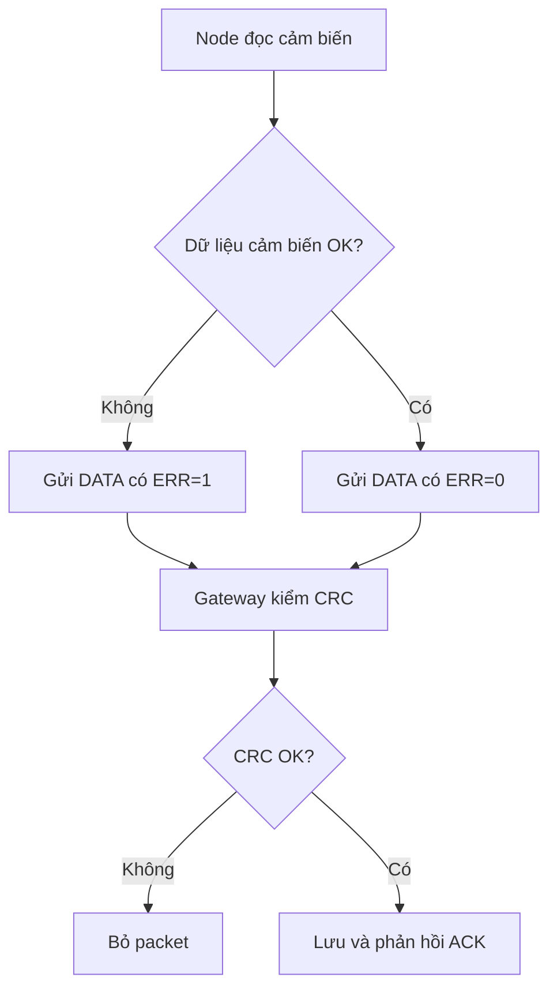

---

## B4.9. Các file phần mềm chính

| File | Vai trò |
| --- | --- |
| `node_main.cpp` | Chương trình chính của node |
| `gateway_main.cpp` | Chương trình chính của gateway |
| `gateway_lora.cpp` | Xử lý nhận/gửi LoRa phía gateway |
| `gateway_web.cpp` | Web dashboard, command, export CSV, OTA gateway |
| `gateway_cloud.cpp` | Upload dữ liệu lên ThingsBoard |
| `gateway_state.cpp` | Lưu trạng thái, history và command đang chờ |
| `gateway_logic.cpp` | Tính cảnh báo, command và thời gian bơm |
| `dht22_sensor.cpp` | Driver đọc DHT22 |
| `soil_moisture.cpp` | Driver đọc cảm biến đất |
| `packet_protocol.cpp` | Encode/decode packet và CRC |
| `project_config.h` | Cấu hình chân GPIO, LoRa, WiFi, cloud, sleep, OTA |

---

## B4.10. Kết luận ngắn gọn

Phần mềm được chia thành hai firmware: node và gateway.

- **Node** tập trung vào đo cảm biến, gửi dữ liệu và tiết kiệm năng lượng bằng deep sleep.
- **Gateway** tập trung vào nhận dữ liệu, kiểm tra lỗi, hiển thị dashboard, gửi cloud và quản lý command.
- **LoRa packet** dùng dạng `KEY=VALUE` nên dễ debug.
- **CRC, ACK, dedup và retry command** giúp hệ thống truyền dữ liệu ổn định hơn.
- **Gateway OTA** là OTA thật qua WiFi/HTTP.
- **Node OTA LoRa** hiện là mô phỏng, dùng để trình bày quy trình truyền chunk và xác nhận dữ liệu.

Câu chốt khi thuyết trình:

> Hệ thống được thiết kế theo hướng node tiết kiệm năng lượng, gateway xử lý trung tâm. Node chỉ thức dậy để đo và gửi dữ liệu, còn gateway luôn hoạt động để nhận dữ liệu, hiển thị, gửi cloud và truyền lệnh điều khiển ngược lại cho node.
