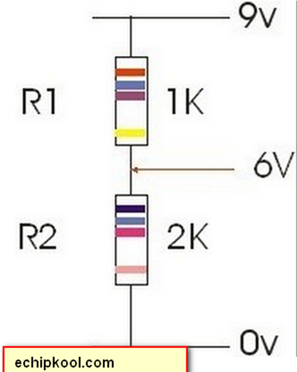

# Project Context - EE4552 Wireless Sensor Network

Tài liệu này giải thích ý tưởng phần mềm và thuật toán theo code hiện tại trong thư mục `src/`.
Đọc cùng với `README/HARDWARE_WIRING_GUIDE.md` là có thể nắm được cả phần cứng, phần mềm và luồng hoạt động của hệ thống.

## 1. Mục tiêu dự án

Hệ thống là mạng cảm biến không dây để giám sát môi trường đất/không khí trên cánh đồng.

Thành phần chính:

- `Node`: đặt ngoài đồng, đọc cảm biến DHT22, cảm biến độ ẩm đất điện dung, đo điện áp pin, gửi dữ liệu bằng LoRa, sau đó deep sleep để tiết kiệm pin.
- `Gateway`: đặt nơi có WiFi, nhận LoRa từ node, lưu lịch sử tạm thời, hiển thị dashboard web, xuất CSV, gửi telemetry lên ThingsBoard và gửi ACK/command ngược về node.

Hiện tại không điều khiển bơm thật. Code có tính `PumpTime` như một giá trị mô phỏng/gợi ý tưới tiêu dựa trên độ ẩm đất, nhiệt độ và độ ẩm không khí. Vì `Config::EnablePumpHardware = false`, gateway không tự động gửi lệnh bật bơm theo `PumpTime`. Một số tên cũ trong code vẫn có chữ `Pump`, nhưng trong thiết kế phần cứng hiện tại không đấu nối bơm.

## 2. Cấu trúc code

| File | Vai trò |
| --- | --- |
| `src/project_config.h` | Toàn bộ cấu hình chân GPIO, LoRa, WiFi, ThingsBoard, sleep, calibration |
| `src/node_main.cpp` | Firmware cho node: đọc cảm biến, đo pin, gửi LoRa, nhận ACK/command, deep sleep |
| `src/gateway_main.cpp` | Firmware cho gateway: nhận LoRa, dashboard web, CSV, ThingsBoard, command, OTA mô phỏng |
| `src/dht22_sensor.cpp/.h` | Driver DHT22 tự viết bằng timing 1-wire |
| `src/soil_moisture.cpp/.h` | Đọc ADC cảm biến đất, median filter, tính `%Vol`, phân loại trạng thái |
| `src/packet_protocol.cpp/.h` | Định dạng packet LoRa, CRC16, encode/decode telemetry, ACK, OTA chunk/status |
| `platformio.ini` | Cấu hình build riêng `env:node` và `env:gateway` |

Build:

```text
pio run -e node
pio run -e gateway
```

## 3. Cấu hình chính

Trong `project_config.h`:

| Nhóm | Giá trị quan trọng |
| --- | --- |
| Node/Gateway ID | `NodeId = 1`, `GatewayId = 1` |
| DHT22 | `DhtPin = GPIO27` |
| Soil ADC | `SoilAdcPin = GPIO34` |
| Battery ADC | `BatteryAdcPin = GPIO35`, `BatteryDividerRatio = 3.2` |
| Sensor power | `SensorPowerPin = GPIO32` |
| Pump hardware | `EnablePumpHardware = false`, không đấu nối bơm thật |
| LoRa | `433E6`, SF7, BW125kHz, CR4/5, 17dBm |
| ACK | `AckTimeoutMs = 2500`; node gửi telemetry một lần, không retry nếu mất ACK |
| Sleep | Mặc định `30` phút, adaptive `5..90` phút |
| Gateway cloud | WiFi + ThingsBoard HTTP telemetry |

## 4. Luồng hoạt động của Node

Firmware node nằm trong `node_main.cpp`.

Trình tự chạy trong `setup()`:

1. Mở Serial `115200`.
2. Bật `SensorPowerPin = GPIO32` lên HIGH.
3. Đưa chân legacy `GPIO25` về OFF; phần cứng hiện tại không đấu nối bơm vào chân này.
4. Đọc runtime config từ ESP32 Preferences:
   - ngưỡng độ ẩm đất,
   - sleep duration,
   - filter mode,
   - pump seconds mô phỏng,
   - control mode,
   - duty cycle mode.
5. Khởi tạo DHT22 ở `GPIO27`.
6. Khởi tạo cảm biến đất ở `GPIO34` với calibration dry/wet.
7. Khởi tạo LoRa một lần. Nếu khởi tạo lỗi thì node ngủ 5 phút rồi chu kỳ sau thử lại.
8. Đọc DHT22.
9. Đọc độ ẩm đất.
10. Đo điện áp pin qua mạch chia áp ở `GPIO35`.
11. Đóng gói telemetry.
12. Gửi telemetry qua LoRa, chờ ACK từ gateway; hiện cấu hình không retry thêm nếu chưa nhận ACK hợp lệ.
13. Nếu ACK có command thì thực thi command.
14. Tính thời gian sleep theo adaptive duty cycle.
15. Tắt LoRa, kéo `SensorPowerPin` LOW, vào deep sleep.

Vì `loop()` gần như không dùng khi deep sleep bật, mỗi chu kỳ node sẽ thức dậy, chạy `setup()`, gửi một lần, rồi ngủ tiếp.

## 5. Đọc DHT22

Driver DHT22 nằm trong `dht22_sensor.cpp`.

Thuật toán:

1. ESP32 kéo chân DATA LOW khoảng `20 ms` để gửi start signal.
2. Chuyển DATA về `INPUT_PULLUP`.
3. Đợi DHT22 phản hồi bằng xung LOW/HIGH.
4. Đọc 40 bit thành 5 byte:
   - byte 0-1: độ ẩm,
   - byte 2-3: nhiệt độ,
   - byte 4: checksum.
5. Kiểm tra checksum:

```text
checksum = (B0 + B1 + B2 + B3) & 0xFF
checksum phải bằng B4
```

1. Tính giá trị:

```text
H_air = rawHumidity / 10.0 + HumidityOffsetRh
T_air = rawTemperature / 10.0 + TempOffsetC
```

1. Validate:
   - `-10 <= T_air <= 50 C`
   - `0 <= H_air <= 100 %RH`
   - biến thiên liên tiếp không quá `2 C` và `5 %RH`
2. Nếu hợp lệ, đưa vào bộ đệm trung bình trượt 5 mẫu và làm tròn 0.1.
3. Nếu lỗi timing, checksum hoặc validate, trả `errorFlag = 1`.

4. Cấu hình ADC 12 bit, attenuation `ADC_11db`.
5. Đọc nhiều mẫu ADC từ `GPIO34`.
6. Loại bỏ 3 mẫu đầu để cảm biến ổn định.
7. Nếu ADC nằm ngoài khoảng hợp lệ `100..4090`, tăng bộ đếm lỗi và retry sau `350 ms`.
8. Nếu lỗi ADC quá ngưỡng, set `errorFlag = 1`.
9. Với mẫu hợp lệ, lọc median để lấy `ADC_filtered`.

## 6. Đọc độ ẩm đất

Driver cảm biến đất nằm trong `soil_moisture.cpp`.

Thuật toán:

1. Cấu hình ADC 12 bit, attenuation `ADC_11db`.
2. Đọc nhiều mẫu ADC từ `GPIO34`.
3. Loại bỏ 3 mẫu đầu để cảm biến ổn định.
4. Nếu ADC nằm ngoài khoảng hợp lệ `100..4090`, tăng bộ đếm lỗi và retry sau `350 ms`.
5. Nếu lỗi ADC quá ngưỡng, set `errorFlag = 1`.
6. Với mẫu hợp lệ, lọc median để lấy `ADC_filtered`.
7. Quy đổi sang độ ẩm đất:

```text
H_soil = (ADC_dry - ADC_filtered) * 60 / (ADC_dry - ADC_wet)
ADC_dry = 3400
ADC_wet = 1200
```

1. Giới hạn `H_soil` trong `0..60 %Vol`, làm tròn 0.1.
2. Phân loại:

| H_soil | Soil status |
| ---: | --- |
| `> 42` | `OVER_MOISTURE` |
| `> 33..42` | `NORMAL` |
| `> 24..33` | `LIGHT_DRY` |
| `> 15..24` | `NEED_WATERING` |
| `<= 15` | `URGENT_WATERING` |

## 7. Đo điện áp pin



Node đo pin bằng `GPIO35` qua mạch chia áp `220k/100k`.

Thuật toán trong `readBatteryVoltage()`:

1. Cấu hình ADC 12 bit, attenuation `ADC_11db`.
2. Đọc 16 mẫu bằng `analogReadMilliVolts()`.
3. Lấy trung bình điện áp tại GPIO35.
4. Nhân với `BatteryDividerRatio = 3.2`:

```text
V_bat = V_gpio35 * 3.2
```

Mức pin ảnh hưởng đến adaptive sleep:

- `V_bat < 3.3V`: sleep `90` phút.
- `V_bat < 3.5V`: sleep `60` phút.

## 8. Packet LoRa và CRC

Protocol nằm trong `packet_protocol.cpp`.
Packet là chuỗi text dạng `KEY=VALUE`, có CRC16-CCITT ở cuối.

### 8.1. Telemetry Node -> Gateway

Dạng packet:

```text
TYPE=DATA,NODE=1,PID=1,T=30.1,HA=70.2,HS=25,VB=4.05,ADC=2480,SOIL=LIGHT_DRY,ERR=0,CRC=....
```

Trường dữ liệu:

| Trường | Ý nghĩa |
| --- | --- |
| `TYPE=DATA` | Gói telemetry |
| `NODE` | ID node |
| `PID` | Packet ID, tăng theo mỗi lần gửi |
| `T` | Nhiệt độ không khí, độ C |
| `HA` | Độ ẩm không khí, `%RH` |
| `HS` | Độ ẩm đất, `%Vol` |
| `VB` | Điện áp pin |
| `ADC` | Giá trị ADC đất đã lọc |
| `SOIL` | Trạng thái đất |
| `ERR` | Có lỗi cảm biến hay không |
| `CRC` | CRC16 của chuỗi trước trường CRC |

### 8.2. ACK Gateway -> Node

Dạng packet:

```text
TYPE=ACK,NODE=1,PID=1,OK=1,CMD=NONE,PARAM=0,STATUS=OK,CRC=....
```

ACK vừa xác nhận gateway đã nhận dữ liệu, vừa có thể kèm command cho node.

Command code hiện có:

| Command | Ý nghĩa |
| --- | --- |
| `SET_SLEEP_DURATION` | Đổi thời gian sleep cố định, 5..90 phút |
| `SET_THRESHOLD` | Đổi ngưỡng độ ẩm đất trong runtime config |
| `SET_FILTER_MODE` | Chọn `AVERAGE`/`MEDIAN` theo config, hiện driver đất vẫn dùng median |
| `SET_PUMP_TIME` | Đổi thời gian tưới gợi ý/mô phỏng |
| `SET_CONTROL_MODE` | Đổi `MANUAL`/`AUTO` trong config |
| `SET_DUTY_CYCLE` | Chọn `FIXED`/`ADAPTIVE` |
| `SLEEP_NOW` | Lệnh ngủ ngay, hiện tại chỉ log |
| `START_OTA` | Bắt phiên OTA mô phỏng qua LoRa |
| `START_PUMP` | Lệnh legacy trong code; không dùng cho phần cứng hiện tại |

## 9. Gửi LoRa và ACK

Node gửi telemetry bằng `sendTelemetry()`:

1. Encode telemetry thành chuỗi có CRC.
2. Gửi qua LoRa.
3. Chuyển LoRa về receive mode.
4. Chờ ACK trong `2500 ms`.
5. Decode ACK và kiểm tra:
   - CRC đúng,
   - `NODE` đúng `NodeId`,
   - `PID` trùng packet vừa gửi.
6. Nếu ACK hợp lệ và `OK=1`, xem như gửi thành công.
7. Nếu fail, node không gửi lại packet đó; chu kỳ hiện tại kết thúc và node ngủ đến lần đo sau.

Gateway khi nhận packet:

1. Decode telemetry và check CRC.
2. Bỏ qua packet trùng `PID` của cùng node, nhưng vẫn gửi lại ACK để node không retry mãi.
3. Lưu packet vào history vòng 64 mẫu.
4. In log Serial.
5. Upload ThingsBoard nếu WiFi/cloud đang bật.
6. Gửi ACK về node.

## 10. Gateway dashboard, CSV và ThingsBoard

Gateway dùng `WebServer` port 80.

Endpoint:

| URL | Chức năng |
| --- | --- |
| `/` | Dashboard HTML đơn giản hiển thị lịch sử telemetry |
| `/export.csv` | Xuất history dạng CSV |
| `/command?node=1&cmd=SET_SLEEP_DURATION&param=10` | Xếp command cho node |
| `/self_ota?url=http://server/firmware.bin&md5=optional` | Gateway self-OTA qua WiFi |

History lưu trong RAM, tối đa 64 bản ghi mới nhất. Mất nguồn gateway sẽ mất history này.

Telemetry gửi lên ThingsBoard bằng HTTP POST:

```json
{
  "Node_ID": 1,
  "T_air": 30.1,
  "H_air": 70.2,
  "H_soil": 25,
  "V_bat": 4.05,
  "RSSI": -80,
  "Error_Flag": 0,
  "Alert": "LIGHT_DRY",
  "PumpTime": 3
}
```

## 11. Thuật toán mô phỏng tưới tiêu

Gateway tính `PumpTime` trong `computePumpTime()`.
Đây chỉ là giá trị gợi ý/mô phỏng, không có mạch bơm trong hướng dẫn phần cứng.

Nếu `errorFlag != 0`:

```text
PumpTime = 0
```

Theo độ ẩm đất:

| Điều kiện | PumpTime cơ sở |
| --- | ---: |
| `H_soil > 42` | 0 s |
| `33 < H_soil <= 42` | 0 s |
| `24 < H_soil <= 33` | 3 s |
| `15 < H_soil <= 24` | 6 s |
| `H_soil <= 15` | 10 s |

Hiệu chỉnh theo môi trường:

| Điều kiện | Điều chỉnh |
| --- | ---: |
| `T_air > 32 C` | `+2 s` |
| `H_air < 50 %RH` | `+3 s` |
| `H_air > 80 %RH` | `-2 s` |

Kết quả bị giới hạn:

```text
0 <= PumpTime <= 15
```

Giá trị này được in trong Serial log, đưa lên ThingsBoard và có thể hiển thị trên dashboard/cloud. Gateway chỉ tự động gửi `START_PUMP` nếu `EnablePumpHardware = true`; hiện tại cấu hình là `false`, nên đây là phần mô phỏng tính năng.

## 12. Adaptive duty cycle

Node tính thời gian ngủ trong `computeAdaptiveSleepSeconds()`.

Nếu runtime config `dutyCycleMode = FIXED`, node dùng `sleepMinutes` đã lưu trong Preferences.

Nếu `ADAPTIVE`, node dùng quy tắc:

| Điều kiện | Sleep |
| --- | ---: |
| `errorFlag != 0` | 30 phút |
| `V_bat < 3.3V` | 90 phút |
| `V_bat < 3.5V` | 60 phút |
| `SOIL=URGENT_WATERING` | 5 phút |
| `SOIL=NEED_WATERING` | 10 phút |
| `SOIL=LIGHT_DRY` | 20 phút |
| `SOIL=OVER_MOISTURE` | 60 phút |
| Còn lại / `NORMAL` | 30 phút |

Trước khi sleep, node:

- Cho LoRa sleep/end.
- Tắt SPI.
- Kéo `SensorPowerPin` LOW.
- Gọi `esp_sleep_enable_timer_wakeup()`.
- Gọi `esp_deep_sleep_start()`.

## 13. Command và runtime config

Gateway không gửi command riêng lẻ ngay lập tức. Command được xếp vào `pendingCommands[nodeId]`.
Khi node gửi telemetry lần tiếp theo, gateway đưa command vào ACK. Cách này hợp với node tiết kiệm pin vì node chỉ nghe LoRa trong thời gian ngắn sau khi gửi.

Node lưu một số cấu hình bằng ESP32 Preferences namespace `node_cfg`:

| Key | Ý nghĩa |
| --- | --- |
| `soil_th` | Ngưỡng độ ẩm đất |
| `sleep_min` | Thời gian sleep cố định |
| `filter` | Mode filter |
| `pump_s` | Thời gian tưới gợi ý/mô phỏng |
| `ctrl` | Control mode |
| `duty` | Duty cycle mode |

Ví dụ gọi command từ trình duyệt:

```text
http://<gateway-ip>/command?node=1&cmd=SET_SLEEP_DURATION&param=10
http://<gateway-ip>/command?node=1&cmd=SET_DUTY_CYCLE&param=ADAPTIVE
http://<gateway-ip>/command?node=1&cmd=SET_THRESHOLD&param=20
```

## 14. OTA trong code

Code có 2 cơ chế OTA:

### 14.1. Gateway self-OTA qua WiFi

Endpoint:

```text
/self_ota?url=http://server/firmware.bin&md5=optional_md5
```

Gateway tải firmware qua HTTP, ghi bằng thư viện `Update`, thành công thì reboot.
Partition OTA cho gateway được cấu hình trong `partitions_gateway_ota.csv`.

### 14.2. Node OTA mô phỏng qua LoRa

Khi gateway queue command `START_OTA`, node nhận trong ACK và chạy phiên OTA mô phỏng:

1. Node gửi `OTA_READY`.
2. Gateway gửi 10 chunk dữ liệu firmware giả lập.
3. Node check CRC từng chunk.
4. Node ACK từng chunk.
5. Nhận đủ chunk thì node gửi `OTA_SUCCESS`.

Hiện tại đây là mô phỏng giao thức OTA, chưa ghi firmware thật vào flash của node.

## 15. Cách đọc log để debug

Node log đúng:

```text
===== EE4552 NODE FIRMWARE =====
LoRa init OK
DHT: T=... C H=... %RH ERR=0
SOIL: ADC=... H=... %Vol status=... ERR=0
Battery: ... V
LoRa TX: TYPE=DATA,...
ACK received: TYPE=ACK,...
Sleep duration: ... min
```

Gateway log đúng:

```text
===== EE4552 GATEWAY FIRMWARE =====
LoRa init OK
Gateway ready
DATA RX node=1 pid=... T=... H=... Soil=... ADC=... V=... RSSI=... Alert=... PumpTime=...
ThingsBoard HTTP status: 200
ACK TX: TYPE=ACK,...
```

Nếu cần debug nhanh:

- LoRa lỗi: xem `LoRa init failed`, kiểm tra dây SPI/nguồn/anten.
- DHT lỗi: `DHT ... ERR=1`, kiểm tra DATA GPIO27, pull-up, nguồn.
- Soil lỗi: `SOIL ... ERR=1`, kiểm tra AOUT GPIO34 và giá trị ADC.
- Pin sai: kiểm tra mạch chia áp GPIO35 và `BatteryDividerRatio`.
- Gateway không lên cloud: kiểm tra WiFi, token ThingsBoard, `EnableCloudUpload`.

## 16. Giới hạn hiện tại của code

- Môi trường mẫu đang cấu hình `NodeId = 1`, chưa có bảng quản lý nhiều node đầy đủ ngoài mảng `lastPacketIdByNode[256]`.
- Dashboard history chỉ lưu RAM 64 mẫu, không có database bền vững.
- ThingsBoard gửi bằng HTTP, chưa dùng MQTT.
- `PumpTime` là mô phỏng/gợi ý. Không có mạch bơm trong phần cứng hiện tại, và không đấu nối gì vào GPIO25.
- Node OTA qua LoRa là mô phỏng chunk/CRC/status, chưa flash firmware thật.
- Gateway self-OTA có ghi firmware thật qua WiFi.

## 17. Tóm tắt một chu kỳ hoạt động

```text
Node wake up
  -> bật nguồn cảm biến
  -> đọc DHT22
  -> đọc cảm biến độ ẩm đất
  -> đo pin
  -> tạo TYPE=DATA + CRC
  -> gửi LoRa cho Gateway
  -> đợi ACK/command
  -> thực thi command nếu có
  -> tính adaptive sleep
  -> tắt LoRa/cảm biến
  -> deep sleep

Gateway chạy liên tục
  -> nghe LoRa
  -> nhận TYPE=DATA
  -> check CRC và chống trùng packet
  -> lưu history RAM
  -> tính Alert và PumpTime mô phỏng
  -> upload ThingsBoard
  -> gửi TYPE=ACK về Node
  -> phục vụ dashboard/export/command qua web
```
