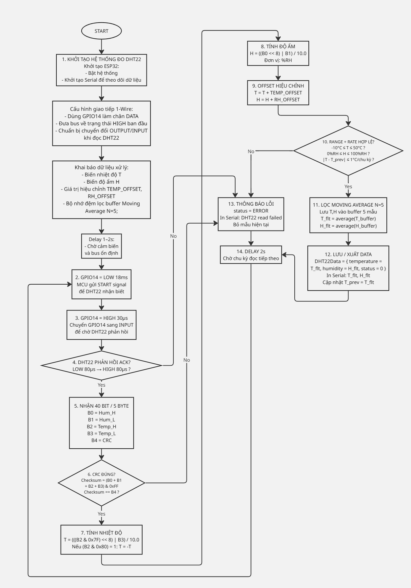

# Hướng dẫn test DHT22

## Wiring

| DHT22        | ESP32    |
| ------------ | -------- |
| `+` / VCC    | `3V3`    |
| `-` / GND    | `GND`    |
| `OUT` / DATA | `GPIO14` |

Quy trình hoạt động của hệ thống đo DHT22 được thực hiện theo chu kỳ lặp lại như sau:

Ban đầu, ESP32 được khởi tạo và thiết lập giao tiếp với cảm biến DHT22 thông qua cơ chế 1-Wire. Chân GPIO14 được sử dụng làm chân dữ liệu, được đưa về trạng thái HIGH (idle) để đảm bảo bus ổn định. Đồng thời, hệ thống khởi tạo Serial để theo dõi dữ liệu và khai báo các biến xử lý như nhiệt độ (T), độ ẩm (H), giá trị hiệu chỉnh và bộ lọc Moving Average. Sau đó, hệ thống chờ khoảng 1–2 giây để cảm biến ổn định.

Trong mỗi chu kỳ đo, ESP32 gửi tín hiệu START bằng cách kéo chân DATA xuống LOW trong 18 ms, sau đó đưa lên HIGH trong 30 µs và chuyển sang chế độ INPUT để chờ phản hồi từ cảm biến.

Cảm biến DHT22 sẽ phản hồi bằng tín hiệu ACK (LOW 80 µs → HIGH 80 µs). Nếu không nhận được phản hồi này, hệ thống xác định lỗi và chuyển sang bước xử lý lỗi.

Nếu ACK hợp lệ, hệ thống tiến hành đọc 40 bit dữ liệu (5 byte), bao gồm độ ẩm, nhiệt độ và byte kiểm tra CRC. Sau đó, hệ thống kiểm tra tính đúng đắn của dữ liệu bằng cách tính checksum: (B0 + B1 + B2 + B3) & 0xFF và so sánh với byte CRC. Nếu không khớp, dữ liệu bị loại bỏ.

Khi dữ liệu hợp lệ, hệ thống tính toán nhiệt độ và độ ẩm theo công thức chuẩn của DHT22, đồng thời áp dụng các giá trị hiệu chỉnh (offset) để tăng độ chính xác.

Tiếp theo, dữ liệu được kiểm tra điều kiện hợp lệ gồm: nhiệt độ trong khoảng -10°C đến 50°C, độ ẩm trong khoảng 0–100%RH và tốc độ thay đổi nhiệt độ không vượt quá 1°C mỗi chu kỳ. Nếu không đạt, dữ liệu bị loại bỏ.

Nếu đạt yêu cầu, hệ thống áp dụng bộ lọc Moving Average với 5 mẫu gần nhất để giảm nhiễu. Giá trị trung bình sau lọc được sử dụng làm kết quả cuối cùng, lưu vào cấu trúc dữ liệu và xuất ra Serial. Đồng thời cập nhật giá trị nhiệt độ trước đó để phục vụ kiểm tra ở chu kỳ tiếp theo.

Trong trường hợp xảy ra lỗi tại bất kỳ bước nào, hệ thống sẽ thông báo lỗi và bỏ qua mẫu hiện tại.

Cuối cùng, hệ thống chờ 2 giây trước khi lặp lại chu kỳ đo tiếp theo.